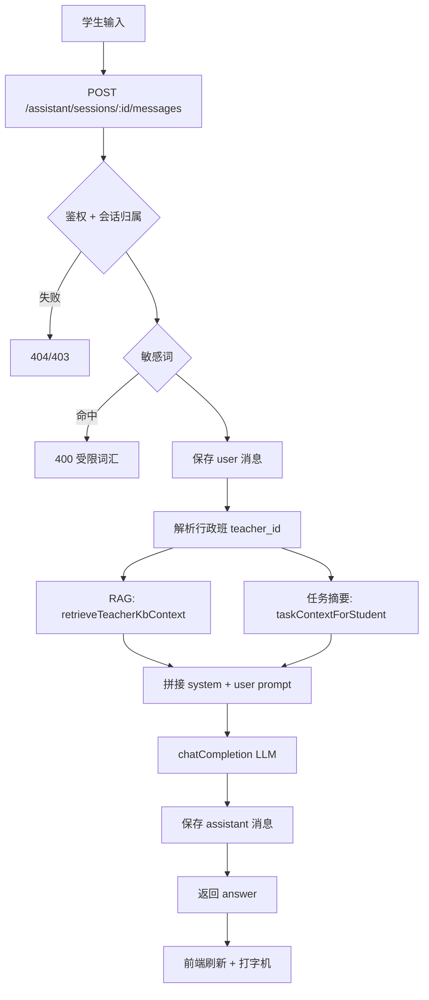

# 学生端「AI 答疑助手」模块评估文档

> **文档性质**：只读代码扫描结论 + 优化方案评估清单，供产品 / 教学 / 技术评审。  
> **扫描日期**：2026-05-19  
> **状态**：待评审，**尚未开始代码改造**。

---

## 1. 背景与目标

学生端「AI 答疑助手」已具备基础对话能力：会话管理、消息发送、RAG 知识库检索、LLM 回答、敏感词拦截。当前页面与交互仍偏「通用聊天 + 评语汇总」，与「实训场景智能答疑 / 能力辅导」的定位仍有差距。

**本轮扫描目标：**

1. 梳理前端页面、API、后端接口、RAG、LLM、提示词、会话与权限现状；
2. 明确当前回答策略与限制实现位置；
3. 从代码角度列出问题与风险；
4. 给出可分批实施的优化方案与优先级，供评审决策。

**本轮约束（评审通过前不改）：**

- 不改后端接口（扫描阶段）
- 不改数据库
- 不改权限规则
- 不改 RAG 数据范围
- 不改 LLM / Embedding 系统配置
- 不改已有 AI 批改逻辑

---

## 2. 功能总览（代码映射）

| 层级 | 路径 / 说明 |
|------|-------------|
| **前端页面** | `frontend/src/views/student/StudentAssistant.vue`（单文件实现，无 `components/chat/*`） |
| **前端 API** | `frontend/src/api/assistant.js` |
| **路由** | `frontend/src/router/index.js` → `/student/assistant`（`StudentAssistant`） |
| **菜单入口** | `frontend/src/layouts/StudentLayout.vue` →「AI 答疑助手」 |
| **后端路由** | `backend/routes/assistantRoutes.js` → 挂载 `app.js` 的 `/api/assistant` |
| **后端 Controller** | `backend/controllers/assistantController.js`（无独立 assistant service 层） |
| **RAG 检索** | `backend/utils/ragRetrieve.js` → `retrieveTeacherKbContext()` |
| **LLM 调用** | `backend/utils/llmClient.js` → `chatCompletion()` |
| **Embedding** | `backend/utils/embeddingClient.js` → `embedTexts()` / `embedTextsBatched()` |
| **知识库上传/切块** | `backend/controllers/kbController.js` + `backend/utils/chunkText.js` |
| **系统配置** | `backend/controllers/settingsController.js` + `system_config` 表 |
| **管理端 LLM 配置 UI** | `frontend/src/views/admin/SystemSettings.vue` |
| **教师助手统计** | `backend/controllers/analyticsController.js` → `getAssistantTeacherStats`；`TeacherAssistantStats.vue` |
| **会话表** | `assistant_sessions` |
| **消息表** | `assistant_messages` |
| **知识库文档表** | `kb_documents` |
| **知识库块表** | `kb_chunks` |

### 2.1 数据库表结构摘要

**assistant_sessions**

| 字段 | 说明 |
|------|------|
| id | 主键 |
| student_id | 学生 ID，会话归属 |
| title | 默认「新对话」（前端首问标题仅 sessionStorage，不写库） |
| created_at / updated_at | 时间戳 |

**assistant_messages**

| 字段 | 说明 |
|------|------|
| id | 主键 |
| session_id | 外键 → assistant_sessions |
| role | `user` \| `assistant` |
| content | 文本内容 |
| created_at | 时间戳 |

**kb_documents**

| 字段 | 说明 |
|------|------|
| teacher_id | 教师私有 |
| category | guide / standard / example / pitfalls / other |
| title, file_path, file_name | 文档元数据 |
| status | processing / ready / failed |
| chunk_count | 切块数量 |

**kb_chunks**

| 字段 | 说明 |
|------|------|
| document_id, teacher_id | 归属 |
| chunk_index, content | 文本块 |
| embedding | JSON 向量（Qwen text-embedding-v4） |

### 2.2 API 清单

| 方法 | 路径 | 角色 | 说明 |
|------|------|------|------|
| GET | `/api/assistant/sessions` | student | 会话列表 |
| POST | `/api/assistant/sessions` | student | 新建会话 `{ title? }` |
| GET | `/api/assistant/sessions/:sessionId/messages` | student | 消息列表 |
| POST | `/api/assistant/sessions/:sessionId/messages` | student | 发送问题 `{ content }` → `{ answer }` |

**教师侧（统计，非对话）：**

| 方法 | 路径 | 说明 |
|------|------|------|
| GET | `/api/analytics/teacher/assistant-stats` | 本班学生高频提问 Top N |

**知识库（教师维护，学生间接消费 RAG）：**

| 方法 | 路径 | 说明 |
|------|------|------|
| GET/POST/DELETE | `/api/kb/documents` | 教师上传 / 列表 / 删除 |

---

## 3. 当前回答流程

```
学生输入问题
    ↓
StudentAssistant.vue → send()
    ↓
POST /api/assistant/sessions/:sessionId/messages  { content }
    ↓
authenticateToken + requireRole(['student'])
    ↓
校验会话归属（session.student_id === req.user.id）
    ↓
assistant_blocked_words 敏感词检测（system_config）
    ↓
INSERT assistant_messages (role = user)
    ↓
kbTeacherIdForStudent()
    → 查 users.class_id → classes.teacher_id（仅行政班班主任）
    ↓
retrieveTeacherKbContext(teacherId, question, topK=6)
    → embedTexts → kb_chunks 余弦相似度 → 拼接文本片段
    ↓
taskContextForStudent()
    → tasks WHERE class_id = 学生行政班，最近 12 条任务摘要
    ↓
拼接 Prompt（仅 1 轮，不含历史消息）：
    system: 仅根据任务摘要 + 知识库片段回答；资料不足请说明
    user:   学生问题 + 任务摘要(≤6000) + 知识库片段(≤6000)
    ↓
chatCompletion({ temperature: 0.3, max_tokens: 2048 })
    ↓
INSERT assistant_messages (role = assistant)
UPDATE assistant_sessions.updated_at
    ↓
返回 { success, data: { answer } }
    ↓
前端 listMessages 刷新 → 打字机效果展示
```

### 3.1 流程图（Mermaid）



---

## 4. 前端现状评估

### 4.1 页面结构

- **布局**：左侧会话列表 + 右侧聊天区 + 底部输入框
- **欢迎态**：3 条示例问题 chip（点击填入输入框）
- **消息渲染**：用户纯文本；助手支持简单 Markdown（`**加粗**`、`` `code` ``、换行）
- **动画**：发送中「思考中…」；回答完成后前端打字机（非 SSE 流式）

### 4.2 能力矩阵

| 能力 | 现状 | 备注 |
|------|------|------|
| 会话列表加载 | ✅ | `listAssistantSessions`，按 updated_at 降序 |
| 新建对话 | ✅ | 无会话时自动创建 |
| 切换会话 | ✅ | 加载对应 messages |
| 发送消息 | ✅ | Enter 发送，Shift+Enter 换行 |
| Loading | ✅ | sending + 打字动画 |
| 错误提示 | ⚠️ | catch → ElMessage；LLM 失败时 answer 写入消息体 |
| 重新生成 | ❌ | 无 |
| 复制回答 | ❌ | 无 |
| 停止生成 | ❌ | 无 |
| 知识库引用展示 | ❌ | 后端未返回 citations |
| 命中 / 通用标识 | ❌ | 仅页头文案提及 RAG |
| 会话标题写库 | ❌ | 首问标题仅 sessionStorage |
| 删除会话 | ❌ | 无接口 |
| 流式输出 | ❌ | 一次性返回后打字机模拟 |

### 4.3 前端限制提示（文案层）

页头与欢迎区明确写「结合本班任务与教师知识库（RAG）」，塑造用户对回答依据的预期，但**无运行时命中反馈**。

---

## 5. 后端现状评估

### 5.1 提示词模板（当前 verbatim 语义）

**System：**

> 你是高职实训场景的答疑助手，仅根据提供的「班级任务摘要」与「教师知识库片段」回答，不要编造未给出的评分细则。若资料不足请明确说明。回答简洁、可操作。

**User 结构：**

```
【学生问题】
{content}

【本班任务与要求摘要（节选）】
{taskCtx 最多 6000 字}

【知识库片段】
{rag 最多 6000 字，无命中则为空}
```

### 5.2 回答策略归类

| 类型 | 是否符合 |
|------|----------|
| ① 严格知识库问答，只能 RAG | Prompt 倾向是，但代码无硬拦截 |
| ② 知识库优先，未命中可通用回答 | **实际最接近**：RAG 空仍调 LLM，由模型自行发挥 |
| ③ 完全开放问答 | Prompt 有限制，不算完全开放 |
| ④ 其他 | 任务摘要作为第二信息源 |

**结论：** Prompt 写「仅根据…」，实现上 **无知识库命中时不拒答**，属于「文案偏严格、行为偏宽松」的混合策略。

### 5.3 限制实现位置

| 限制项 | 实现位置 |
|--------|----------|
| 仅学生可访问 | `assistantRoutes.js` + `requireRole(['student'])` |
| 会话隔离 | SQL `student_id = req.user.id` |
| 敏感词 | `containsBlockedWords` + `assistant_blocked_words` |
| RAG 教师范围 | `kbTeacherIdForStudent` → 行政班 `classes.teacher_id` |
| RAG 检索 | `retrieveTeacherKbContext(teacherId, query, topK=6)` |
| 任务范围 | `taskContextForStudent` → `class_id` 最近 12 条 |
| LLM 未配置 | `chatCompletion` 返回 null → 存「（无回复）」 |
| Embedding 失败 | `retrieveTeacherKbContext` catch → 返回 `''` |
| 多轮上下文 | **未实现**（历史消息不进 prompt） |

### 5.4 权限与数据范围缺口

| 场景 | 当前行为 | 风险 |
|------|----------|------|
| 仅教学班学生（无行政班） | teacherId 可能 null，RAG/任务均为空 | 回答质量差 |
| 教学班任务（teaching_class_id） | 未纳入 taskContext | 问教学班作业时对不上 |
| 协同教师 / 课程负责人 KB | 仅行政班 teacher 的 kb_chunks | 知识库覆盖不全 |
| 跨班 / 跨教师 | 代码无跨 teacher 查询 | 隔离正确，但可能「过窄」 |

### 5.5 LLM / Embedding 配置（system_config）

| 配置键 | 用途 |
|--------|------|
| llm_api_base / llm_api_key / llm_model | Chat Completions |
| embedding_api_base / embedding_api_key / embedding_model | RAG 向量 |
| assistant_blocked_words | 助手敏感词 CSV |

配置入口：管理端「系统设置」；Embedding 另支持环境变量 `DASHSCOPE_API_KEY` 等。

---

## 6. RAG 与知识库逻辑

### 6.1 检索流程

1. `SELECT kb_chunks WHERE teacher_id = ? AND embedding IS NOT NULL`
2. 对学生问题做 `embedTexts`（≤8000 字）
3. 与每条 chunk 计算余弦相似度
4. 取 Top 6，拼接为：

   ```
   【知识库片段 1】（语义相关度约 0.xxx）
   {content 最多 1400 字}
   ```

### 6.2 降级行为

| 条件 | 返回 |
|------|------|
| 无 teacherId | `''` |
| 无 chunk / 无 embedding | `''` |
| Embedding API 失败 | `''` |
| 相似度计算后无结果 | `''` |

**不返回：** 文档 ID、标题、分类、结构化 citations。

### 6.3 知识库生产链路（教师侧）

上传 → `kb_documents`（processing）→ 解析文本 → `chunkText`（900 字块，80 重叠）→ `embedTextsBatched` → 写入 `kb_chunks` → status = ready。

---

## 7. 当前问题清单（评审用）

| # | 问题 | 影响 | 严重度 |
|---|------|------|--------|
| P1 | **多轮对话不进 prompt**，历史仅展示 | 连续追问丢上下文 | 高 |
| P2 | **无知识库命中标识**，用户不知依据 | 信任感 / 录屏展示 | 高 |
| P3 | **无引用来源**（文档名、片段、相似度） | 无法核验、不符合 RAG 产品预期 | 高 |
| P4 | **行政班单轨**：教学班任务/KB 未接入 | 部分学生上下文为空 | 高 |
| P5 | Prompt 写「仅根据资料」，无命中仍调 LLM | 可能编造或泛泛而谈 | 中 |
| P6 | 无通用学习辅导兜底策略（结构化） | 无 KB 时体验弱 | 中 |
| P7 | 无重新生成 / 复制 / 删除会话 | 会话体验落后 | 中 |
| P8 | LLM 未配置 →「（无回复）」 | 用户不知原因 | 中 |
| P9 | 无流式输出 | 长回答等待感强 | 低 |
| P10 | 无问题类型 / 场景快捷入口（除 3 条示例） | 首次使用门槛 | 低 |
| P11 | 无速率限制 / 长度上限（除 DB TEXT） | 滥用与成本风险 | 低 |
| P12 | 会话 title 不写库 | 侧栏长期显示「新对话」 | 低 |

---

## 8. 与「实训档案 / 学情画像」的定位区分

| 模块 | 定位 | 数据形态 |
|------|------|----------|
| **AI 答疑助手** | 实时问答、任务/知识库辅导 | 对话流、即时生成 |
| **实训档案** | 按时间沉淀提交与评价 | 时间轴、历史记录 |
| **学情画像** | 按能力维度汇总诊断 | 统计卡片、维度分析 |

优化时应避免把助手做成「档案/画像的重复入口」，而应强化 **即时辅导 + 可追溯引用 + 场景化提问**。

---

## 9. 建议优化方案

### 9.1 回答策略（推荐：RAG 优先 + 分层兜底）

**目标策略：** 知识库优先 → 任务要求次之 → 通用实训辅导兜底 → 评分细则无资料则拒编。

| 层级 | 条件 | 回答要求 | 前端标识 |
|------|------|----------|----------|
| L1 | RAG 命中 ≥1 | 优先引用 KB，标注来源 | 「知识库命中」 |
| L2 | 有任务摘要 | 结合本班任务要求 | 「任务要求」 |
| L3 | L1/L2 不足 | 允许通用高职实训辅导（调试、文档、提交规范） | 「通用学习建议」 |
| L4 | 问具体评分细则且无资料 | 明确说明无法确认，引导查看成绩报告 | 「需教师确认」 |

**实现要点（后续迭代）：**

- 扩展 `postMessage` 响应：`{ answer, mode, ragHit, sources[] }`（需评审是否接受接口扩展）
- 或先仅前端 + 后端日志，Phase 1 不改响应结构则仅优化 prompt

### 9.2 UI/UX 优化

| 项 | 说明 | 优先级 |
|----|------|--------|
| 工作台布局 | 左会话 / 中对话 / 右「本次依据」面板 | P1 |
| 回答标签 | 知识库命中 / 任务要求 / 通用建议 | P1 |
| 引用卡片 | 文档标题 + 片段摘要 + 相似度 | P1 |
| 问题分类入口 | 提交规范、评分解读、调试运行、文档 README、扩展功能 | P1 |
| 消息操作 | 复制、重新生成 | P2 |
| 会话管理 | 删除、重命名（写库 title） | P2 |
| 空状态分场景 | 无 KB / 无任务 / LLM 未配置 | P2 |
| 流式 SSE | 降低等待焦虑 | P3 |

### 9.3 后端能力增强（不改权限前提下）

| 项 | 说明 | 优先级 |
|----|------|--------|
| 多轮 prompt | 最近 N 轮 user/assistant 纳入 messages | P0 |
| 结构化 RAG | `retrieveTeacherKbContext` 返回 hits 数组 | P0 |
| 任务范围扩展 | 合并 `teaching_class_id` 任务摘要（仍限本学生） | P1 |
| KB 教师范围扩展 | 行政班 teacher + 教学班关联教师 KB 合并检索 | P1 |
| 首问写 title | UPDATE assistant_sessions.title | P2 |
| 重新生成 API | 可选：重发上条 user 不重复 INSERT | P2 |

### 9.4 安全与合规

| 项 | 说明 |
|----|------|
| 保留 | `assistant_blocked_words` |
| 新增建议 | 单条字数上限、日配额、禁止代写完整标准答案（prompt） |
| 固定免责声明 | 「AI 建议仅供参考，评分以教师复核为准」 |
| 审计 | 可选记录 ragHit / mode 供教师统计页分析 |

---

## 10. 实施优先级与工作量粗估

| 阶段 | 内容 | 前端 | 后端 | 数据库 | 接口变更 |
|------|------|------|------|--------|----------|
| **Phase 0** | 评审确认策略与范围 | — | — | — | — |
| **Phase 1（P0）** | 多轮上下文 + prompt 分层兜底 + 命中标识（可先 meta 字段） | 中 | 中 | 否 | 可选扩展响应 |
| **Phase 2（P1）** | 结构化 citations + 右侧面板 + 问题分类 + 教学班任务/KB | 大 | 中 | 否 | 建议扩展响应 |
| **Phase 3（P2）** | 复制/重生成/删会话/标题写库/错误态优化 | 中 | 小 | 可选 | 新增 DELETE 等 |
| **Phase 4（P3）** | SSE 流式、速率限制 | 中 | 中 | 否 | 新增 stream 端点 |

**说明：** 若评审要求「零接口变更」，Phase 1 可仅改 prompt + 多轮 messages，命中标识暂用回答前缀或前端规则推断（体验次优）。

---

## 11. 验收标准建议（改造后）

1. 学生连续追问 3 轮，助手能引用上一轮上下文（非答非所问）。
2. 知识库有文档时，回答展示 ≥1 条引用来源（标题 + 摘要）。
3. 知识库无文档时，展示「未命中知识库」+ 通用学习建议（非空白或「（无回复）」）。
4. 教学班任务相关问题能引用对应任务摘要（若学生仅有教学班任务）。
5. 敏感词、跨学生会话访问仍被拦截（回归权限）。
6. `npm run build` 通过；不影响 AI 批改、成绩报告、实训档案、学情画像页面。
7. 录屏场景：页面具备正式高校实训平台质感，回答依据可解释。

---

## 12. 评审决策项（请勾选 / 备注）

| # | 决策项 | 选项 A | 选项 B | 备注 |
|---|--------|--------|--------|------|
| 1 | 回答策略 | 严格 KB-only | **RAG 优先 + 通用兜底（推荐）** | |
| 2 | 是否扩展 POST messages 响应 | 是（含 sources/mode） | 否（仅改 prompt） | |
| 3 | 教学班任务/KB 是否纳入 | 是 | 否（维持行政班单轨） | |
| 4 | 多轮上下文轮数 N | 4 / 6 / 8 | | |
| 5 | 是否做 SSE 流式 | Phase 1 / Phase 3 / 不做 | | |
| 6 | 是否新增删除会话接口 | 是 / 否 | | |
| 7 | UI 目标 | 轻量优化 / **工作台级改造** | | |

---

## 13. 附录：关键代码索引

```
frontend/src/views/student/StudentAssistant.vue   # 学生助手 UI
frontend/src/api/assistant.js                     # 前端 API
backend/routes/assistantRoutes.js                 # 路由
backend/controllers/assistantController.js        # 核心业务 + prompt
backend/utils/ragRetrieve.js                      # RAG 检索
backend/utils/llmClient.js                        # LLM
backend/utils/embeddingClient.js                  # Embedding
backend/controllers/kbController.js               # 知识库
backend/sql/init.sql                              # 表结构（assistant_*, kb_*）
frontend/src/views/admin/SystemSettings.vue       # LLM/Embedding/敏感词配置
```

---

**文档维护：** 评审通过后，实施阶段可在本文档追加「变更记录」章节，或另开 `14-student-ai-assistant-implementation.md`。
